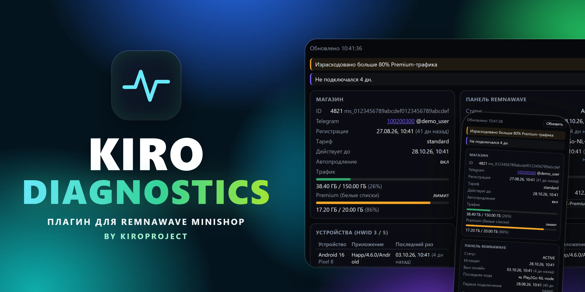
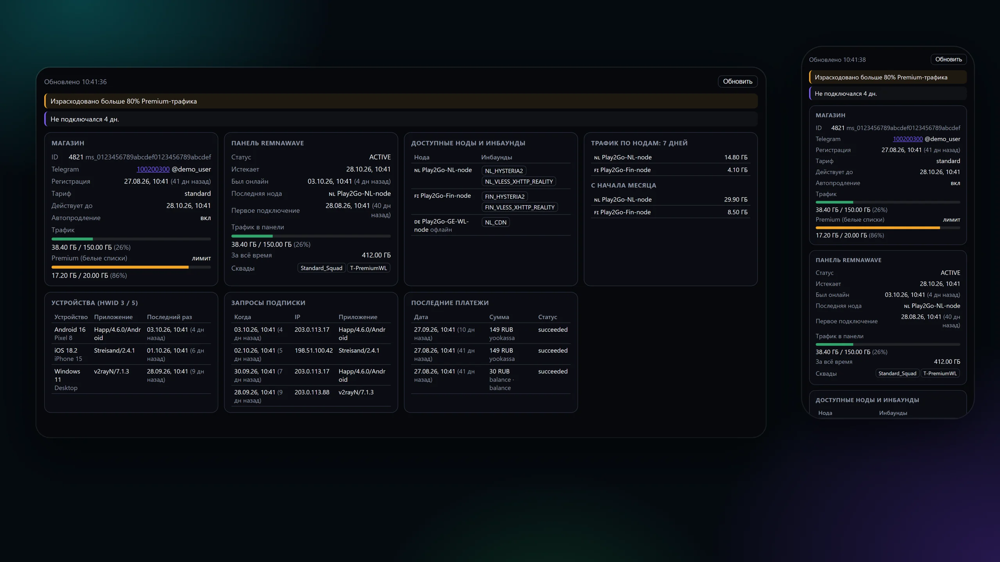

# KIRO Diagnostics — диагностика пользователя для Remnawave Minishop

[](docs/cover.webp)

**KIRO Diagnostics** — плагин для [Remnawave Minishop](https://github.com/3252a8/remnawave-minishop): вкладка **«Диагностика»** в карточке пользователя в админке. Одним экраном показывает всё, что нужно поддержке, чтобы понять, почему у клиента «не работает VPN»: подписку и трафик в магазине, статус в панели Remnawave, доступные ноды и инбаунды, устройства, последние запросы подписки и платежи. Рядом сразу подсвечиваются найденные проблемы.

Версия **1.0.1** · публикатор `kiroproject` · Minishop **3.8.0 и новее** (Plugin API v1, проверено на 3.8.0 и 3.8.1)

## Возможности

* **Автоматические подсказки о проблемах** — истёкшая или неактивная подписка, закончившийся трафик и Premium-трафик, лимит устройств, отключённый сквад, недоступные ноды, пользователь ни разу не подключался. Каждая найденная проблема выводится цветной плашкой (ошибка, предупреждение, заметка).
* **Подписка и трафик в магазине** — тариф, дата окончания, автопродление, использованный и доступный трафик с индикатором, Premium-трафик для белых списков.
* **Статус в панели Remnawave** — статус пользователя, срок, время последней активности, последняя нода, первое подключение, трафик за всё время, список сквадов.
* **Доступные ноды и инбаунды** — на каких нодах и по каким инбаундам пользователю разрешено подключаться; ноды без связи отмечены.
* **Трафик по нодам** — расход за 7 дней и с начала месяца по каждой ноде.
* **Устройства (HWID)** — платформа, система, модель, приложение и время последнего запроса, счётчик «занято из доступных».
* **Запросы подписки** — последние обращения клиента: время, IP-адрес и приложение. Видно, обновляется ли подписка и откуда.
* **Последние платежи** — дата, сумма, провайдер, источник средств и статус.
* **Только чтение** — плагин ничего не меняет ни в магазине, ни в панели, не хранит данных и не требует настройки.
* **Только для администраторов** — запрос идёт через админский маршрут Minishop, роль проверяет ядро.
* **Адаптивная вёрстка** — карточки выстраиваются в сетку на десктопе и в колонку на телефоне, длинные названия приложений и идентификаторы переносятся и не выходят за блоки.

## Скриншоты

[](docs/overview.webp)

## Что проверяет плагин

| Уровень | Проверка |
| --- | --- |
| Ошибка | пользователь заблокирован в магазине; нет подписки; подписка неактивна или истекла; пользователь не связан с панелью; панель не вернула данные; статус в панели не `ACTIVE`; нет ни одного сквада; нет доступных нод; Premium-трафик исчерпан |
| Предупреждение | подписка заканчивается менее чем через 3 дня; скорость ограничена (throttled); израсходовано больше 90% основного трафика; больше 80% Premium-трафика; ноды недоступны; последняя нода не на связи; пользователь ни разу не подключался; достигнут лимит устройств |
| Заметка | не подключался больше 3 дней; нет запросов подписки; подписка не обновлялась больше недели |

## Установка

Плагин подписан публикатором `kiroproject` и устанавливается из этого репозитория по Git. Репозиторий публичный, в корне лежит `minishop-plugin.json` со ссылкой на готовый ZIP и его контрольной суммой.

1. В админке Minishop откройте раздел плагинов и выберите установку из Git-репозитория.
2. Укажите адрес репозитория:

   ```
   https://github.com/kiroproject/kiro-diagnostics
   ```

3. Подтвердите установку и включите плагин. Миграции базы данных не нужны: плагин ничего не хранит.

Minishop проверяет репозиторий каждые 10 минут и предложит обновление, когда выйдет новая версия.

Готовые подписанные архивы каждой версии и краткий список изменений лежат на странице [Releases](https://github.com/kiroproject/kiro-diagnostics/releases), полная история в [CHANGELOG.md](CHANGELOG.md). Архив можно скачать и установить вручную через загрузку пакета в разделе плагинов.

### Требования

* Remnawave Minishop **3.8.0 или новее** с Plugin API v1 (проверено на 3.8.0 и 3.8.1);
* возможность ядра `ui_composition` (вкладка в карточке пользователя);
* подключённая панель Remnawave: без неё вкладка покажет только данные магазина;
* публичный GitHub/GitLab-репозиторий (приватные репозитории Minishop не поддерживает).

## Безопасность и приватность

* Маршрут `GET /api/admin/kiro-diagnostics/users/{id}` находится под `/api/admin`, поэтому роль администратора проверяет ядро Minishop ещё до обработчика. Для остальных пользователей ответ `403`.
* Плагин только читает данные из базы Minishop и API панели и ничего не сохраняет.
* В ответ попадают идентификаторы пользователя, IP-адреса запросов подписки и названия приложений: показывайте вкладку только тем, кому разрешено видеть эти данные.

## Для разработчиков

```
backend/kiro_diagnostics/   маршрут, сбор данных из магазина и панели, правила подсказок
frontend/index.js           вкладка «Диагностика» (frontend host API v1)
locales/                    название вкладки (ru, en)
preview/index.html          автономная страница с заглушкой API для проверки вёрстки
```

Страницу `preview/index.html` отдаёт любой статический сервер из корня репозитория. Адрес `preview/index.html?demo=rich` показывает вымышленного активного подписчика, как на скриншотах; параметр `?side=300` сужает область контента, чтобы проверить сжатие карточек.

## Лицензия

[MIT](LICENSE)
